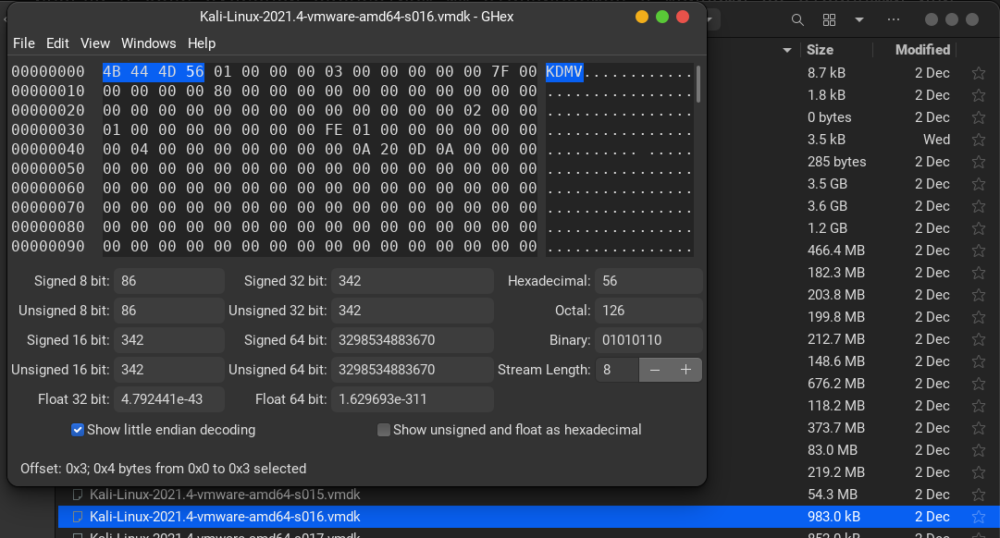

# Magic in the Hex

Иногда в ходе судебной экспертизы мы сталкиваемся с файлами со странными или
неизвестными расширениями. В этих случаях полезно посмотреть на некоторые сигнатуры
форматов файлов, чтобы понять, что они собой представляют. Мы используем так
называемые «магические байты», которые представляют собой первые несколько байтов файла.

Что представляет собой ASCII-представление магических байтов для файла VMDK? Формат
флага будет 3-4 буквы (есть два правильных ответа).

---

VMDK - файлы виртуаьлных машин vmware

Открыть файл `.vmdk` в hex редакторе

