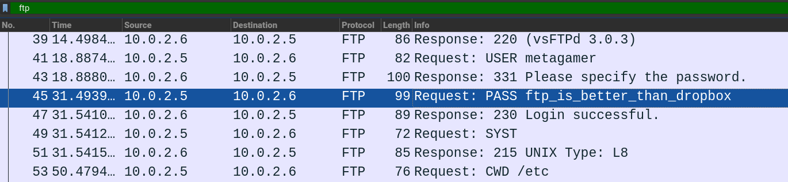

# Sharing Files and Passwords

FTP-серверы предназначены для обмена файлами, но если его связь не зашифрована,
он также может передавать пароли. Пароль в этом `pcap` для получения флага

---

Открыть файл pcapng в wireshark. Отфильтровать по протоколу

